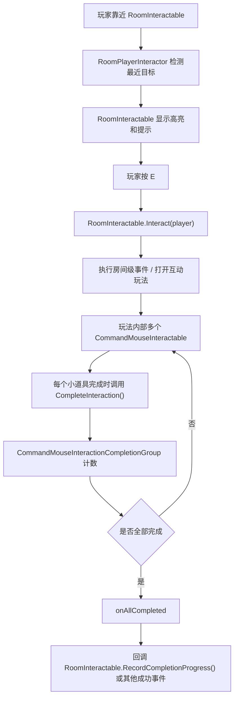
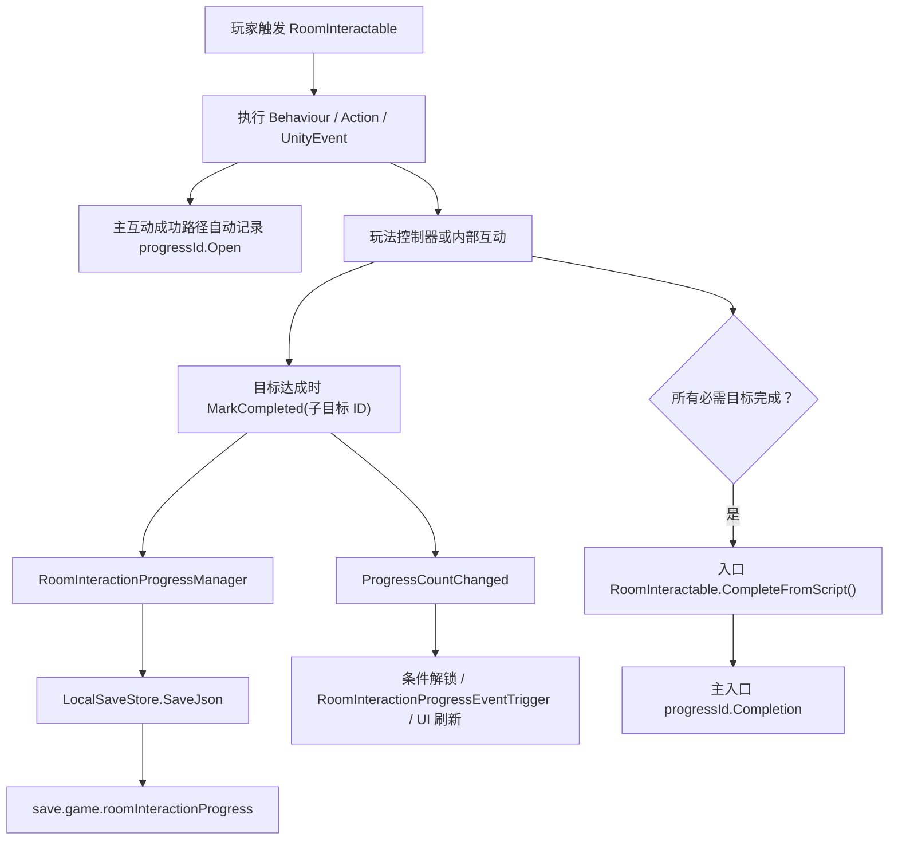

# Generic World And Command Interaction System Guide

这份文档用于帮助下一次接手项目的 AI 或开发者快速理解通用互动系统。

`Room` 是这套系统最初在 Room 场景开发时留下的历史前缀，不代表它只能用于 Room。`RoomInteractable`、`RoomInteractionBehaviour`、`RoomInteractionProgressManager`、`RoomInteractionUnlockConditions` 等组件是全项目通用的世界互动、目标进度、条件解锁和继续位置系统；City Walk、Office、后续新场景和新玩法都应优先复用它们，而不是另起一套互动或存档链条。

类名、文件名和 Inspector 字段保留 `Room` 前缀，是为了不破坏现有 Scene、Prefab、ScriptableObject 和序列化引用。新增功能遵循这套系统的职责边界即可，不需要为了通用性重命名旧代码。

重点说明两套交互的边界：

- `RoomInteractable`：玩家靠近世界物体后按交互键触发，负责通用世界互动入口、提示、高亮、进度记录、条件解锁。
- `CommandMouseInteractable`：进入某个互动玩法后，用鼠标射线点击具体小道具，负责玩法内部的小物件选择、高亮、点击和完成状态。

不要让 `RoomInteractable` 直接猜玩法内部有多少小道具完成。玩法内部如果有多个 `CommandMouseInteractable`，应该使用 `CommandMouseInteractionCompletionGroup` 收集它们的完成状态，全部完成后再回调外层 `RoomInteractable`。

## 常用源码位置

- `Assets/Script/Room/RoomInteractable.cs`
- `Assets/Script/Room/RoomPlayerInteractor.cs`
- `Assets/Script/Room/RoomInteractableHighlight.cs`
- `Assets/Script/Room/RoomInteractionProgressManager.cs`
- `Assets/Script/Room/RoomInteractionProgressEventTrigger.cs`
- `Assets/Script/Room/RoomInteractionUnlockConditions.cs`
- `Assets/Scripts/Save/LocalSaveStore.cs`
- `Assets/Scripts/Root/GameFlow/GameFlowManager.cs`
- `Assets/Scripts/Root/GameFlow/GameFlowDefinition.cs`
- `Assets/Scripts/Root/GameFlow/GameFlowSceneController.cs`
- `Assets/Scripts/Root/Transition/SceneTransitionController.cs`
- `Assets/Script/Room/RoomInteractionBehaviour.cs`
- `Assets/Script/Room/RoomInteractionAction.cs`
- `Assets/Script/Room/RoomTopDownPlayerMovementControlSetter.cs`
- `Assets/Script/Command/CommandMouseInteractable.cs`
- `Assets/Script/Command/CommandMouseInteractionCompletionGroup.cs`
- `Assets/Script/Command/CommandTopDownPlayerMovementControlBehaviour.cs`
- `Assets/Script/Command/CommandTopDownPlayerMovementControlSetter.cs`
- `Assets/Script/Command/CommandEnableTopDownPlayerMovementControl.cs`
- `Assets/Script/Command/CommandDisableTopDownPlayerMovementControl.cs`
- `Assets/Script/Command/CommandToothbrushSwipeInteraction.cs`
- `Assets/Script/Command/CommandMedicineBottleInteraction.cs`

## 文档与源码的优先级

本文档用于说明职责、标准链条和搭建规范；它不是对运行时细节的替代。出现下面任一情况时，不要根据流程图猜测，直接打开对应的权威源码或场景配置确认：

- 文档描述与 Inspector 现有绑定看起来不一致。
- 需要知道某个事件的准确调用顺序、是否自动记录 Open/Completion、是否会重复触发。
- 要扩展存档格式、恢复状态、解锁条件或场景切换。
- 要修改一个已有案例，而不是新搭建玩法。

下表是“功能问题 -> 优先查看的真实文件”的索引。除非修改框架本身，不需要在这里以外做全项目搜索。

| 想确认什么 | 权威代码 / 配置 | 先看哪些内容 |
| --- | --- | --- |
| 世界物体如何被发现、按键后执行什么、何时记录 Open | `Assets/Script/Room/RoomInteractable.cs` | `Interact`、`ExecutePrimaryInteraction`、`RecordOpenProgressIfNeeded`、`CompleteFromScript` |
| 玩家如何选中最近目标、显示提示和交互键 | `Assets/Script/Room/RoomPlayerInteractor.cs`、`Assets/Script/Room/RoomInteractionPromptUI.cs` | `Update`、目标刷新、`Interact` 调用位置 |
| 自定义场景行为怎样接入世界互动 | `Assets/Script/Room/RoomInteractionBehaviour.cs`、`Assets/Script/Room/RoomInteractionContext.cs`、`Assets/Script/Room/RoomInteractionAction.cs` | `Execute(RoomInteractionContext)`、场景组件与 ScriptableObject 的边界 |
| 进度按什么作用域保存、保存了哪些字段、写入时机 | `Assets/Script/Room/RoomInteractionProgressManager.cs` | `ResolveCurrentScopeId`、`MarkProgress`、`SaveProgress`、`LoadProgress` |
| 本地存档底层 Key 和 JSON 如何写入 | `Assets/Scripts/Save/LocalSaveStore.cs` | `Keys`、`SaveJson`、`TryLoadJson`；业务玩法不要直接调用 `PlayerPrefs` |
| 某互动何时解锁、完成后是否禁用、默认互动是否执行 | `Assets/Script/Room/RoomInteractionUnlockConditions.cs`、`Assets/Script/Room/RoomInteractable.cs` | `AreSatisfied`、`ResolveActiveInteractionMode`、`completionInteractionMode` |
| 进度变化怎样驱动 Timeline、显隐或其它对象 | `Assets/Script/Room/RoomInteractionProgressEventTrigger.cs` | `HandleProgressChanged`、`invokeIfAlreadySatisfiedOnEnable` |
| 主剧情步骤、完成步骤和 Scene 选择 | `Assets/Scripts/Root/GameFlow/GameFlowManager.cs`、`Assets/Scripts/Root/GameFlow/GameFlowDefinition.cs`、`Assets/Resources/GameFlow/Game Flow Definition.asset` | `CompleteCurrentStepAndLoadNext`、`JumpToStep`、`stepId`、`contentKey` |
| 切场景是否会走统一淡出淡入 | `Assets/Scripts/Root/Transition/SceneTransitionController.cs` | `LoadScene`、`LoadSceneRoutine`；不要直接绕过它调用 `SceneManager.LoadScene` |
| 玩法内部的 3D 鼠标小物件和全部完成判断 | `Assets/Script/Command/CommandMouseInteractable.cs`、`Assets/Script/Command/CommandMouseInteractionCompletionGroup.cs` | `CompleteInteraction`、`onCompleted`、`onAllCompleted` |
| Office 电脑 UI 的打开、关闭、输入屏蔽、窗口切换和工作日案件推进 | `Assets/Script/Room/RoomComputerScreenController.cs`、`Assets/Script/Office/Computer/OfficeComputerWorkdayDefinition.cs`、`Assets/Script/Room/RoomFirstPersonCameraInteractor.cs`、`Assets/Resources/UI/OfficeComputerScreenUI.prefab`、`Assets/SO/Office/Computer/` | `Execute`、`Open`、`ShowInbox`、`ShowDocuments`、`ShowTasks`、`SelectDecision`，以及 Workday SO 的 `cases` |
| Dog 与 Door 这两个已存在案例到底何时完成 | `Assets/Script/Room/RoomDogAffectionInteraction.cs`、`Assets/Script/Room/RoomCompleteInteractionAction.cs`、`Assets/Scenes/city walk.unity`、`Assets/SO/CityWalk/Door_1.asset`、`Assets/SO/CityWalk/Dog.asset`、`Assets/SO/CityWalk/_Done.asset` | Dog 的 `CompleteInteraction` 与 Door 的 `_Done` Action；以 Scene 里的 `progressId` 和 `completionInteractionMode` 为准 |
| Play Mode 测试时如何清除当前互动进度 | `Assets/Script/Room/Editor/RoomInteractionProgressDebugTools.cs` | Unity 菜单 `Tools/互动测试/清除当前 Scene 的互动进度` |

场景、Prefab、ScriptableObject 里的 Inspector 绑定也是运行时行为的一部分。改已有功能时，先看这张表定位脚本，再看对应 Scene/Prefab/Asset 的序列化配置；不要只根据同名脚本推断当前对象一定用了它。

## 总体流程



## RoomInteractable 职责

`RoomInteractable` 是房间级交互入口。它不负责具体小游戏规则，只负责“玩家是否能交互”和“交互后触发什么”。

### Detection

- `isInteractable`：是否允许被 `RoomPlayerInteractor` 检测。关闭后不会出现提示和高亮，也不会响应按键交互。
- `detectionCenter`：距离检测中心。为空时使用自身 `transform.position`。
- `interactionRange`：玩家距离小于等于这个值时可交互。
- `ignoreVerticalDistance`：开启后只按 XZ 平面距离判断，适合桌面物品、地面物品等高度差场景。

`RoomPlayerInteractor` 每帧遍历 `RoomInteractable.ActiveInteractables`，找到范围内最近的一个作为 `CurrentTarget`。范围内的物体会高亮，最近的那个会被标记为 current target。

### Prompt

- `promptText`：提示文本，支持 `{key}` 占位符，例如 `按下 {key} 进行交互`。
- `promptAnchor`：提示 UI 跟随的世界坐标锚点。为空时使用自身 Transform。
- `promptWorldOffset`：提示锚点偏移。

`RoomInteractionPromptUI` 会显示当前目标的提示文本。

### Highlight

- `highlightController`：控制高亮表现的 `RoomInteractableHighlight`。
- `autoFindHighlightController`：为空时自动从子物体查找。

`RoomInteractable.SetHighlightState(highlighted, currentTarget)` 会转发给 `RoomInteractableHighlight`，并触发：

- `onHighlightChanged(bool)`
- `onCurrentTargetChanged(bool)`

### Interaction Logic

主互动触发时会按顺序执行：

1. `interactionBehaviours`
2. `interactionActions`
3. `onInteract`
4. `onInteractWithPlayer`
5. `onInteractWithTarget`
6. 打开次数记录
7. resume state 保存

`RoomInteractionBehaviour` 是场景组件形式的行为基类，适合拖场景对象引用。

`RoomInteractionAction` 是 `ScriptableObject` 形式的行为基类，适合复用规则资源。

`RoomUnityEventInteractionBehaviour` 是通用事件行为，适合在 Inspector 里直接绑定 UnityEvent。

### Resume State

`RoomInteractionResumeOverride` 用于在互动执行后保存当前步骤的继续位置。

- `saveResumeTransformOnInteract`：是否保存。
- `resumeTransform`：继续游戏时玩家应回到的坐标。
- `saveRotation`：是否保存旋转。

保存逻辑走 `RoomInteractionProgressManager.Instance.SetResumeStateFromTransform(...)`。

### Progress

`RoomInteractable` 使用一个 `progressId` 记录两类次数：

- `Open`：按 E 打开/进入过几次。
- `Completion`：玩法真正通过几次。

字段说明：

- `progressId`：这个互动共享的进度 ID。为空则不记录。
- `openProgressIncrement`：每次按 E 成功打开时增加多少 Open 次数。
- `completionTaskProgressIncrement`：玩法完成时增加多少 Completion 次数。
- `onOpenProgressRecorded`：Open 次数写入后触发。
- `onCompletionTaskProgressRecorded`：Completion 次数写入后触发。

重要规则：

- 按 E 进入玩法只应该记录 `Open`。
- 玩法真正完成后才调用 `RecordCompletionProgress()`。
- 如果玩法里有多个鼠标小道具，必须等 `CommandMouseInteractionCompletionGroup.onAllCompleted` 后再调用 `RecordCompletionProgress()`。

### Conditional Interaction

`useConditionalInteraction` 开启后，`RoomInteractable` 会先检查 `unlockConditions`：

- 条件满足：执行主互动。
- 条件不满足但 `defaultInteraction` 有配置：执行默认互动。
- 条件不满足且没有默认互动：不可检测。

`RoomInteractionUnlockConditions` 可检查：

- 当前步骤内某些 `progressId` 的 Open/Completion 次数。
- 当前场景通关次数。
- 指定场景通关次数。

`RoomInteractionVariant defaultInteraction` 是条件不满足时的备用互动，内部也有 prompt override、事件、behaviour/action 和 resume override。

## RoomInteractableHighlight 职责

`RoomInteractableHighlight` 只负责表现，不做交互判定。

它可以控制：

- `highlightedObjects`：普通高亮时启用的对象。
- `highlightedBehaviours`：普通高亮时启用的组件。
- `highlightRenderers` + `highlightedOverlayMaterial`：给 Renderer 追加高亮材质。
- `currentTargetObjects`：当前最近目标时额外启用的对象。
- `currentTargetBehaviours`：当前最近目标时额外启用的组件。
- `currentTargetOverlayMaterial`：当前最近目标额外追加的材质。

材质高亮是“追加材质再恢复原材质”的方式。不要在外部直接改这些 Renderer 的 `materials`，否则可能和高亮缓存冲突。

## RoomPlayerInteractor 职责

`RoomPlayerInteractor` 挂在玩家身上。

- `detectionOrigin`：检测点。为空时使用玩家自身。
- `interactionKey`：默认 `E`。
- `promptUI`：提示 UI，可自动查找。

每帧会：

1. 找到所有可检测的 `RoomInteractable`。
2. 给范围内物体设置普通高亮。
3. 选择最近的目标作为 current target。
4. 显示对应提示。
5. 玩家按交互键时调用 `CurrentTarget.Interact(gameObject)`。

## RoomInteractionProgressManager 职责

这是全局进度管理器，会 `DontDestroyOnLoad`。

进度按 scope 保存：

- 优先使用当前 `GameFlow` 的 stepId，scope 形如 `step:xxx`。
- 如果没有有效 stepId，退回当前场景名，scope 形如 `scene:room`。

同一个 `progressId` 下分别保存：

- `completionCount`
- `openCount`

常用 API：

- `MarkOpened(progressId)`
- `MarkCompleted(progressId)`
- `MarkProgress(progressId, countType, increment)`
- `GetProgressCount(progressId, countType)`
- `IsCompleted(progressId, minimumCompletionCount)`
- `SetResumeStateFromTransform(transform)`
- `ClearCurrentProgress()`

`RoomInteractionProgressEventTrigger` 可以监听某个 `progressId` 达到指定次数后触发事件，适合把 Timeline、显隐物体、流程跳转等表现逻辑挂回场景对象。

## 玩法进度与存档：后续功能只读这一节

这一节是后续新增“完整玩法”的接入约定。电脑、开锁、整理文件、检查物品等，凡是有多个目标、允许中途退出、并且需要下次启动后恢复进度的功能，都按这里处理。

### 三层状态不要混用

| 状态层 | 使用的系统 | 保存内容 | 适用范围 |
| --- | --- | --- | --- |
| 主剧情步骤 | `GameFlowManager` | 当前 `stepId`、已完成的 `stepId` | 决定加载哪个 Scene、显示哪个 `contentKey` |
| 场景通关 | `GameProgressManager` | 每个 Scene 的通关次数 | 首次进入、场景整体通关条件 |
| 房间互动与玩法目标 | `RoomInteractionProgressManager` | 每个 `progressId` 的 Open/Completion 次数、继续位置 | 单个入口、子目标、条件解锁、玩法恢复 |

新玩法的内部目标必须使用第三层。不要把玩法目标写到 `GameProgressManager`，也不要直接调用 `PlayerPrefs` 或 `LocalSaveStore` 新建临时 Key。

`RoomInteractionProgressManager` 已经会在每次变化后立即通过 `LocalSaveStore` 写入：

- 存档 Key：`save.game.roomInteractionProgress`
- 底层：当前是 `PlayerPrefs` + JSON；业务脚本不直接接触它。
- 作用域：优先为 `step:<GameFlow stepId>`；没有有效 GameFlow 时才是 `scene:<SceneName>`。
- 每个 `progressId` 持久化两种计数：`openCount` 与 `completionCount`。
- 同一作用域还会保存 `RoomInteractionResumeState`，只包含玩家位置和朝向。

这意味着：切场景、退出游戏、重新启动后，玩法目标计数会恢复；但普通 MonoBehaviour 字段、UI 激活状态、按钮选中状态不会自动恢复，玩法控制器必须在打开时用进度管理器重新构建自己的显示状态。

### 当前真实调用链



`RoomInteractable` 的执行顺序是：`interactionBehaviours`、`interactionActions`、三个 UnityEvent、自动记录 Open、可选继续位置。它不会自动知道玩法内部是否已经通关；玩法控制器必须在真正完成时显式调用外层入口的 `CompleteFromScript()` 或 `RecordCompletionProgress()`。

### Open、Completion 和重复调用规则

- `Open`：玩家从房间入口走主互动真正进入/打开玩法一次。主互动的 `RoomInteractable.progressId` 非空时会自动记录；条件不满足时执行的 `defaultInteraction` 不会自动增加 Open。
- `Completion`：玩法达成设计目标一次。只能在玩法的成功出口记录。
- `MarkCompleted` 是累加，不是布尔赋值。可重复点击的确认按钮必须先判断该目标是否已完成，避免重复加计数。
- 单次目标：`GetCompletionCount(id) >= 1` 或 `IsCompleted(id)` 表示已完成。
- “阅读过邮件”这类只要打开即可达成的目标，可以记录 `MarkOpened(子目标 ID)`；真正处理完成、提交、确认的目标使用 `MarkCompleted(子目标 ID)`。

### 现有 Door 和 Dog 为什么行为不同

这两个都是正确使用同一存档链条的案例，区别只在“何时写入 Completion”。

| 入口 | 入口进度 ID | 完成发生位置 | 重启后不可再互动的原因 |
| --- | --- | --- | --- |
| `city walk/Building_10/Door_1` | `CityWalk.Door1` | 依次执行 `Door_1.asset` 的对白 Action 和 `_Done.asset` 的 `RoomCompleteInteractionAction`，本次按键内立即完成 | `completionInteractionMode = DisableInteraction`，读取到 Completion >= 1 后入口不可检测 |
| Dog | `CityWalk.DogAffection` | `RoomDogAffectionInteraction` 等动画和对白结束，再调用 `roomInteractable.CompleteFromScript()` | 同样是 DisableInteraction；完成记录会保存在当前作用域，重启后仍生效 |

`_Done.asset` 不是独立存档方案，它只是通用的 `RoomCompleteInteractionAction`，最后仍会调用 `RoomInteractable.CompleteInteraction()`，进入同一个 `RoomInteractionProgressManager`。

### 新增“一个入口、多个玩法目标”的标准搭建

以 Office 电脑为例，推荐拆成一个主入口和多个内部目标：

| 角色 | 推荐 ID | 何时记录 | 用途 |
| --- | --- | --- | --- |
| 电脑入口 | `Office.Computer` | 按入口互动时自动记 Open；全部工作完成时记 Completion | 控制电脑是否能再次进入、驱动大剧情 |
| 邮件工作 | `Office.Computer.Mail` | 玩家提交正确处理结果时 `MarkCompleted` | 恢复邮件工作状态、解锁后续目标 |
| 文件工作 | `Office.Computer.Documents` | 玩家确认文件核对完成时 `MarkCompleted` | 恢复文件工作状态、解锁后续目标 |
| 排程工作 | `Office.Computer.Schedule` | 玩家提交排程时 `MarkCompleted` | 恢复排程工作状态、作为总完成条件 |

ID 使用 `SceneOrFeature.System.Target` 的命名方式，保持稳定。已经进入存档的 ID 不要改名；改名会被视为一个新的未完成目标。

电脑控制器的职责应当是：

1. 通过 `RoomInteractionBehaviour.Execute(RoomInteractionContext)` 从电视入口打开 UI，并缓存 `context.Interactable` 作为外层入口。
2. 每次打开 UI 时读取 `RoomInteractionProgressManager.Instance.GetCompletionCount(...)`，设置各个静态 UI 对象的可见状态、按钮状态和已完成提示。不要只依赖上一次运行时留在内存里的 bool。
3. 某个工作确认成功时，若该子目标尚未完成，调用 `MarkCompleted(对应 ID)`；随后刷新 UI。
4. 检查所有必需子目标均为 Completion >= 1 后，只调用一次缓存入口的 `CompleteFromScript()`。
5. 主入口的 `completionInteractionMode` 按设计选择：一次性玩法用 `DisableInteraction`；完成后仍可查看桌面但不再重复结算，用 `UseDefaultInteraction` 并在默认互动中只打开只读 UI；可重复日常工作则用 `IgnoreCompletionProgress`。

### 已落地的 Office 电脑工作日

当前 Office 的电脑入口是 `Assets/Scenes/Office.unity` 中 `TV_02 (2)` 上的 `RoomInteractable`，入口 ID 为 `Office.Computer.Workday.One`，完成模式目前为 `IgnoreCompletionProgress`：工作做完后仍可以重新打开电脑查看“Workday Complete”，但不会重复完成主入口。

案件配置集中放在 `Assets/SO/Office/Computer/`，当前资源是 `OfficeComputerWorkday_One.asset`。结构定义在 `Assets/Script/Office/Computer/OfficeComputerWorkdayDefinition.cs`：

- 一个 `OfficeComputerWorkdayDefinition` 可以有多个 `cases`，用于后续扩展为每天 5 到 8 个事务。
- 每个案件分别配置 Mail、Documents、Task 的稳定 `progressId`；正确提交 Task 才代表案件完成。
- 选错决定可写入可选的 `incorrectDecisionProgressId` 的 `Open` 计数，供评分、剧情或同事关系使用，选错不会阻断再次选择。
- 文案、决策名称、反馈和正确答案都在 SO 中配置；`OfficeComputerScreenUI.prefab` 只保留可在 Inspector 中调整的静态 UI、图标、TMP 文本和按钮引用，不在脚本里硬编码这些内容。

新增 Office 电脑玩法配置时，优先在 `Assets/SO/Office/` 下建立该玩法自己的子目录；不要把 Office 的新资源混放进 CityWalk 或通用 `_Done.asset` 目录。新增案件时保持已经上线的 `progressId` 不变，并确认 UI 中预留的决策按钮数量足够。

内部 UI 按钮不是 `CommandMouseInteractable`，因此不需要为了按钮再挂 Command 组件。它们可以直接调用电脑控制器的公开无参数方法；只有玩法内部存在 3D 鼠标小道具时，才使用 `CommandMouseInteractable` 和 `CommandMouseInteractionCompletionGroup`。

### 玩法恢复和跨场景表现

- 进入 Office 电脑 UI 后关闭、重新进入：控制器读子目标进度，恢复当前完成情况。
- 离开 Office Scene 再回来、退出游戏后重启：同样读子目标进度恢复。
- 其它场景对象需要对某个子目标作出反应：挂 `RoomInteractionProgressEventTrigger`，监听子目标 ID 的 `Completion`；希望重载场景后立刻还原表现时，勾选 `invokeIfAlreadySatisfiedOnEnable`。
- 子目标之间有先后关系：场景入口使用 `RoomInteractionUnlockConditions` 检查前一个 ID 的 `Completion`；电脑 UI 的 Button 则由电脑控制器读取同一进度后设置 `Button.interactable` 和提示状态。不要在多个 UI 点击回调里各自散落不同的条件判断。
- 需要在玩法完成后切场景：先记录所有子目标和主入口 Completion，再调用 `GameFlowManager` 的推进接口。它会复用 `SceneTransitionController` 的统一淡出、加载、淡入。

### 当前存档能力边界

当前 Room 进度存档只适合“计数 / 已完成标记 / 玩家继续位置”。以下状态可以直接用不同 ID 表示：

- 多个独立工作是否完成。
- 某封邮件是否已阅读、某文件是否已打开。
- 通过次数、失败次数或收集数量。
- 二选一结果：为每个合法结果单独准备稳定 ID，并确保一次任务只会写入一个结果。

以下情况不要自行增加 `PlayerPrefs` Key：

- 需要保存任意文本、动态列表、任务排序、倒计时的精确秒数。
- 一项任务需要保存多个数值、复杂枚举或可变长度数据。
- 需要版本迁移的数据。

遇到这些情况，应先扩展 `RoomInteractionProgressManager` 的 `SaveData`，或在 `LocalSaveStore.Keys` 中新增经过命名和版本设计的专用玩法存档入口；再让玩法控制器只通过该管理器读写。这样仍然维持统一的存档路径，不能绕开它直接写 `PlayerPrefs`。

### 提交前检查表

1. 主入口 `RoomInteractable.progressId` 是否稳定且非空。
2. 每个内部目标是否有唯一、稳定的 ID，并只在真实达成时记录 Completion。
3. 打开玩法是否只增加主入口 Open，而非误记 Completion。
4. 每个可能重复触发的完成按钮是否具有“已经完成则不再累加”的保护。
5. 重新打开、重进 Scene、重启游戏时，UI 是否从 `RoomInteractionProgressManager` 重新恢复。
6. 所有子目标完成后是否只触发一次外层 `CompleteFromScript()`。
7. 需要推动其它对象时，是否优先用 `RoomInteractionProgressEventTrigger` 或 `RoomInteractionUnlockConditions`。
8. 需要推进主剧情时，是否走 `GameFlowManager`，而不是直接 `SceneManager.LoadScene`。

## 后续 AI / 开发者最小阅读规则

以后用户提出“新增一个玩法，并且要保存多个互动目标”时，先阅读本节和本文件的 `RoomInteractable 职责`、`RoomInteractionProgressManager 职责` 两节即可；不需要重新全项目搜索。

只有在下列情况才额外阅读源码：

- 要改变全局存档格式：`RoomInteractionProgressManager.cs`、`LocalSaveStore.cs`。
- 要改变剧情步骤或场景切换：`GameFlowManager.cs`、`GameFlowDefinition.cs`、`SceneTransitionController.cs`。
- 玩法内部是 3D 鼠标小道具：再阅读 `CommandMouseInteractable.cs` 和 `CommandMouseInteractionCompletionGroup.cs`。
- 玩法入口是新的 Room 通用能力：再阅读 `RoomInteractionBehaviour.cs` 和 `RoomInteractable.cs`。

## CommandMouseInteractable 职责

`CommandMouseInteractable` 是玩法内部的鼠标小道具交互组件。

它和 `RoomInteractable` 的区别：

- `RoomInteractable` 是玩家靠近后按 E 的房间入口。
- `CommandMouseInteractable` 是进入玩法后，用鼠标指向并点击的小对象。

### Detection

- `targetCamera`：射线相机。为空且 `autoUseMainCamera` 开启时使用 `Camera.main`。
- `raycastLayers`：射线层级。
- `maxRaycastDistance`：最大射线距离。
- `triggerInteraction`：是否命中 Trigger。
- `ignoreWhenPointerOverUI`：鼠标在 UI 上时是否忽略场景射线。

### State

- `isInteractable`：关闭后不会被鼠标射线检测、点击或显示高亮。
- `disableInteractionOnCompleted`：调用 `CompleteInteraction()` 后自动关闭选择和高亮。
- `IsCompleted`：只读完成状态。

### Highlight

- `targetRenderers`：要追加高亮材质的 Renderer。
- `autoFindRenderers`：为空时自动收集当前物体和子物体 Renderer。
- `hoverGlowMaterial`：鼠标悬停时追加的材质。

### Events

- `onHoverEnter`
- `onHoverExit`
- `onClick`
- `onClickObject(GameObject)`
- `onClickCollider(Collider)`
- `onCompleted`
- `onCompletedObject(GameObject)`

调用 `CompleteInteraction()` 后会：

1. 清掉 hover 状态和高亮材质。
2. 标记 `IsCompleted = true`。
3. 触发完成事件。
4. 如果 `disableInteractionOnCompleted` 为 true，关闭 `isInteractable`，防止再次被选中或高亮。

调用 `ResetCompletion()` 会重置完成状态并重新允许交互。

## 多个 CommandMouseInteractable 的全部完成判断

使用 `CommandMouseInteractionCompletionGroup`。

把它挂在一个玩法根节点上，例如 `BathroomMiniGameRoot`。

配置方式：

1. 将玩法内部所有必须完成的小道具挂上 `CommandMouseInteractable`。
2. 每个小道具自己的玩法通过时调用 `CommandMouseInteractable.CompleteInteraction()`。
3. 在根节点挂 `CommandMouseInteractionCompletionGroup`。
4. 手动填 `requiredInteractables`，或者开启 `autoFindInteractablesInChildren` 让它自动从子物体收集。
5. 在 `onAllCompleted` 里绑定外层 `RoomInteractable.RecordCompletionProgress()`，或者绑定关闭 UI、推进剧情、播放 Timeline 等成功事件。

这个组件内部用完成集合计数，不限制完成顺序。玩家可以任意选择互动顺序，只要所有 required item 都完成，就触发一次 `onAllCompleted`。

重要字段：

- `requiredInteractables`：需要全部完成的小道具。
- `autoFindInteractablesInChildren`：自动从子物体找。
- `includeInactiveChildren`：自动查找时是否包含 inactive 子物体。
- `countAlreadyCompletedOnEnable`：启用时是否把已经完成的小道具计入进度。
- `invokeAllCompletedOnce`：全部完成事件是否只触发一次。
- `invokeWhenEmpty`：没有任何 required item 时是否也算完成。一般保持 false，避免漏配。
- `onItemCompleted(GameObject)`：单个小道具完成。
- `onAllCompleted()`：全部完成。

## 通用功能规范

当需求里明确说“通用”时，如果是新加功能，默认同时考虑 Room 和 Command 两套入口，除非用户明确只要其中一套。

- 房间级按 E 触发的通用功能，优先新增或扩展 `RoomInteractionBehaviour` 实现，放在 `Assets/Script/Room`。
- 玩法内部鼠标点击、Timeline、UnityEvent 可直接绑定的通用功能，优先新增或扩展 `Command` 组件，放在 `Assets/Script/Command`，并加 `AddComponentMenu("Command/...")`。
- 如果这个 Command 通用功能也需要被 `RoomInteractable.interactionBehaviours` 或其它房间交互流程调用，Command 组件也要继承 `RoomInteractionBehaviour` 并实现 `Execute(RoomInteractionContext context)`。
- 如果功能作用在共享运行时状态上，例如玩家移动控制，优先把真正的状态开关和公开 API 放在被控制组件本身，再由 Room/Command 两侧的适配组件调用，避免两边复制核心逻辑。
- 对于开启/关闭这类二态流程，除了可配置 Setter，也优先提供固定语义脚本，例如 `EnableX` 和 `DisableX`，方便在其它交互脚本里直接拖对应流程。
- Command 通用组件要提供无参数方法，方便绑定到 `UnityEvent`；需要布尔值时，同时提供 `SetX(bool)` 和明确的 `EnableX()` / `DisableX()` 包装方法。
- 用户说明“不用编译”或“我自己进编辑器编译”时，不运行 Unity 编译或 `dotnet build`，只做代码与轻量文本检查。

### RoomTopDownPlayerMovement 控制开关

`RoomTopDownPlayerMovement` 提供 `SetMovementControlEnabled(bool)`。关闭后不响应 WASD/方向键移动输入，并会清理脚步声、移动按键状态和 Walk 动画状态。

Room 入口使用 `RoomTopDownPlayerMovementControlSetter`：

- 挂在任意 `RoomInteractable` 相关对象上。
- 放进 `interactionBehaviours`。
- `targetMovement` 可手动拖玩家的 `RoomTopDownPlayerMovement`。
- `targetMovement` 留空时，默认从互动上下文里的玩家对象上查找。
- `movementControlEnabled` 不勾选为屏蔽移动控制，勾选为恢复移动控制。

Command 入口使用以下脚本：

- `CommandTopDownPlayerMovementControlSetter`：可配置开启或关闭，适合需要一个组件通过布尔值切换两种状态的情况。
- `CommandEnableTopDownPlayerMovementControl`：固定开启移动控制，适合直接放进 `interactionBehaviours` 或绑定到恢复流程。
- `CommandDisableTopDownPlayerMovementControl`：固定关闭移动控制，适合直接放进 `interactionBehaviours` 或绑定到屏蔽流程。
- 三个脚本都继承 `RoomInteractionBehaviour`，可以被 `RoomInteractable.interactionBehaviours` 调用，也可以绑定 `CommandMouseInteractable.onClick`、玩法完成事件、Timeline Signal 或其它 `UnityEvent`。
- 常用 UnityEvent 绑定方法：`ApplyConfiguredState()`、`EnableMovementControl()`、`DisableMovementControl()`、`Apply()`、`SetMovementControlEnabled(bool)`。
- `targetMovement` 可手动拖玩家的 `RoomTopDownPlayerMovement`；留空时可从 `RoomInteractionContext.Player`、当前对象子物体或场景中查找。

## 牙刷左右滑动玩法

使用 `CommandToothbrushSwipeInteraction`。

挂在牙刷对象上，牙刷对象也需要有 `CommandMouseInteractable` 和 Collider。

运行规则：

1. 鼠标射线悬停牙刷时，`CommandMouseInteractable` 显示高亮。
2. 玩家按下鼠标左键，`CommandMouseInteractable.onClick` 触发 `BeginSwipe()`。
3. 按住鼠标左右拖动，牙刷沿 `localSlideAxis` 在 `slideRange` 内移动。
4. 从一侧端点滑到另一侧端点算一次。
5. 达到 `requiredSwipeCount` 后调用 `CompleteInteraction()`。
6. 可隐藏 `objectsToHideOnCompleted`，显示 `objectsToShowOnCompleted`。
7. 默认会调用牙刷的 `CommandMouseInteractable.CompleteInteraction()`，使牙刷不再高亮/可选。
8. 如果牙刷在 `CommandMouseInteractionCompletionGroup.requiredInteractables` 里，组会收到完成事件。

关键字段：

- `mouseInteractable`：牙刷的鼠标交互组件。为空时自动获取当前物体上的组件。
- `slideTarget`：实际移动的 Transform。为空时移动当前物体。
- `localSlideAxis`：本地滑动方向，默认 Local X。
- `slideRange`：左右单侧最大距离。
- `mouseSensitivity`：鼠标横向移动到模型位移的倍率。
- `endpointThreshold`：滑到单侧范围多少比例后算到端点。
- `requiredSwipeCount`：需要完成几次左右滑动。
- `completeCommandInteractable`：通过后是否自动标记 `CommandMouseInteractable` 完成。

## 药瓶旋转、开盖、倒药玩法

使用 `CommandMedicineBottleInteraction`。

脚本挂在药瓶玩法 Root 上。入口 `CommandMouseInteractable` 可以只负责打开这个玩法对象；药瓶玩法对象激活后，`CommandMedicineBottleInteraction` 可以自己用 `interactionCamera` 做射线检测，不要求药瓶 Root 自己也挂 `CommandMouseInteractable`。Root 下有两个子模型：药盖和瓶身，它们需要各自有 Collider，或者子物体里有 Collider。

如果药瓶玩法使用独立摄像机，不是 `Main Camera`，在 `CommandMedicineBottleInteraction.interactionCamera` 填这个摄像机，并保持 `applyInteractionCameraToMouseInteractable` 开启。脚本会自动把这个摄像机写到 Root 的 `CommandMouseInteractable.targetCamera`，同时关闭 `autoUseMainCamera`。药瓶玩法默认开启 `allowInteractionWhenPointerOverUI`，因此即使鼠标处在 UI/遮罩上，也允许该玩法继续做 3D 射线检测。

默认情况下，`enableDirectMouseInput` 会让药瓶脚本自己处理玩法内点击和拖动。只要玩法 Root 处于 Active 状态，点击药盖/瓶身 Collider 就能进入逻辑。

如果药瓶 Root 自己也挂了 `CommandMouseInteractable`，`autoBindMouseInteractableClick` 可以自动监听它的 `onClickCollider`。如果想完全手动管理事件链，可以关闭这个选项，然后按下面方式绑定。

手动绑定方式：

- Root 的 `CommandMouseInteractable.onClickCollider` -> Root 上的 `CommandMedicineBottleInteraction.OnClickedCollider(Collider)`

如果暂时不想传 Collider，也可以绑定：

- Root 的 `CommandMouseInteractable.onClick` -> Root 上的 `CommandMedicineBottleInteraction.OnClicked()`

但推荐使用 `onClickCollider`，因为脚本要根据命中的 Collider 判断玩家点的是药盖还是瓶身。

运行规则：

1. 初始未旋转时点击药盖，药盖小幅上移，表现为打开药瓶。
2. 点击瓶身并按住鼠标拖动，瓶子根据鼠标拖动旋转。
3. 鼠标横向拖动控制本地 Y 轴旋转。
4. 鼠标纵向拖动控制本地 Z 轴旋转。
5. 如果瓶子已经旋转过，再点击药盖，会先恢复初始方向，再播放药盖向上飞离。
6. 药盖飞离后，玩家再点击瓶身，瓶身会斜倒，表现为倒药。
7. 倒药后会逐个播放 `capsuleTransforms` 里的胶囊药倒出。
8. 胶囊药全部倒出来以后才触发 `onCompleted`，并可调用唯一的 `CommandMouseInteractable.CompleteInteraction()`。

关键字段：

- `mouseInteractable`：这个玩法唯一的 `CommandMouseInteractable`。
- `autoBindMouseInteractableClick`：自动监听唯一 `CommandMouseInteractable` 的点击事件。
- `interactionCamera`：这个玩法使用的独立摄像机，会同步给唯一的 `CommandMouseInteractable`。
- `allowInteractionWhenPointerOverUI`：关闭 `CommandMouseInteractable.ignoreWhenPointerOverUI`，适合 UI/独立相机玩法。
- `enableDirectMouseInput`：药瓶脚本自己处理鼠标点击/拖动，不依赖入口 `CommandMouseInteractable`。
- `directRaycastLayers`：药瓶玩法内直接射线检测的 LayerMask，需要包含药盖/瓶身 Collider 所在 Layer。
- `capTransform`：药盖模型。
- `bottleTransform`：瓶身模型。
- `rotationTarget`：拖动瓶身时实际旋转的对象。留空使用 Root。
- `pourTarget`：倒药时实际倾斜的对象。留空优先使用 `bottleTransform`。
- `capOpenLocalOffset`：普通开盖时药盖上移距离。
- `capSeparatedLocalOffset`：药盖飞离后的本地偏移。
- `horizontalRotationSensitivity`：横向拖动旋转速度。
- `verticalZRotationSensitivity`：纵向拖动 Z 轴旋转速度。
- `pourLocalEulerOffset`：倒药时的本地旋转偏移。
- `capsuleTransforms`：必须全部倒出的胶囊药列表。
- `capsulePourTargets`：可选，每颗胶囊倒出后的目标位置。未配置时使用偏移自动散开。
- `completeMouseInteractableOnFinished`：胶囊全部倒出后，是否标记唯一的 `CommandMouseInteractable` 完成。

如果这个玩法也属于一组“不限顺序全部完成”的互动之一，就把 Root 上这个唯一的 `CommandMouseInteractable` 放进 `CommandMouseInteractionCompletionGroup.requiredInteractables`。只有胶囊全部倒出后，它才会 `CompleteInteraction()`，组收集器才会把这个玩法算作完成。

## 推荐搭建方式

### 单个房间入口打开一个复杂互动

1. 场景物体挂 `RoomInteractable`。
2. `RoomInteractable.onInteract` 或 `interactionBehaviours` 打开玩法 UI/相机/根节点。
3. 不要在按 E 时直接调用 `RecordCompletionProgress()`。
4. 玩法根节点挂 `CommandMouseInteractionCompletionGroup`。
5. 玩法内部每个小道具完成时调用自己的 `CompleteInteraction()`。
6. `CommandMouseInteractionCompletionGroup.onAllCompleted` 里再绑定：
   - `RoomInteractable.RecordCompletionProgress()`
   - 隐藏玩法根节点
   - 关闭遮罩
   - 推进剧情或播放 Timeline

### 多个小道具顺序不限

每个小道具只关心自己是否完成。组只关心全部是否完成。

不要写类似“牙刷完成后检查牙膏、杯子、毛巾是否完成”的互相依赖逻辑。这样会让顺序和状态变得难维护。

### 已完成后屏蔽高亮

小道具完成时调用：

```csharp
commandMouseInteractable.CompleteInteraction();
```

默认会关闭该对象的鼠标选择和 hover glow。

如果某个完成后仍希望可再次点击，关闭它的 `disableInteractionOnCompleted`。

## 给后续 AI 的修改守则

- 如果需求是“玩家靠近后按 E 触发”，优先改 `RoomInteractable` 或 `RoomInteractionBehaviour`。
- 如果需求是“鼠标点击玩法里的某个物体”，优先改 `CommandMouseInteractable` 或新增 Command 玩法组件。
- 如果需求是“多个小道具全部完成后才算通过”，使用 `CommandMouseInteractionCompletionGroup`，不要把完成判断塞进外层 `RoomInteractable`。
- 如果需求是“通过后不再高亮/不再选中”，调用 `CommandMouseInteractable.CompleteInteraction()`。
- 如果需求是“记录玩法通过进度”，最终回调外层 `RoomInteractable.RecordCompletionProgress()`。
- 如果需求是“只记录进入过几次”，使用 `Open` 次数，通常由 `RoomInteractable.Interact()` 自动记录。
- 如果需求是“条件解锁下一个互动”，使用 `RoomInteractionUnlockConditions` 检查指定 `progressId` 的 Open 或 Completion 次数。
- 修改场景绑定前先确认同名物体，尤其是 `room.unity` 里有多个 `Toothbrush_*`。

## 常见问题

### Q: 怎么判断玩法里所有互动是不是都完成了？

把所有小道具放进 `CommandMouseInteractionCompletionGroup.requiredInteractables`。每个小道具完成时调用 `CompleteInteraction()`。组的 `onAllCompleted` 就是全部完成回调。

### Q: RoomInteractable 什么时候算完成？

只有玩法真的达成目标后才算完成。按 E 进入玩法不等于完成，只算 Open。

### Q: 一个互动玩法里小道具顺序不固定怎么办？

不需要顺序逻辑。每个小道具独立完成，组收集完成状态。全部完成后统一回调。

### Q: 为什么完成后还会被高亮？

确认完成时调用的是 `CommandMouseInteractable.CompleteInteraction()`，并且 `disableInteractionOnCompleted` 为 true。

### Q: Completion 和 Open 有什么区别？

`Open` 是进入或打开次数。`Completion` 是玩法通过次数。解锁剧情时通常检查 `Completion`。
